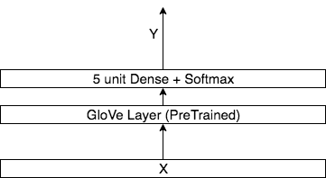
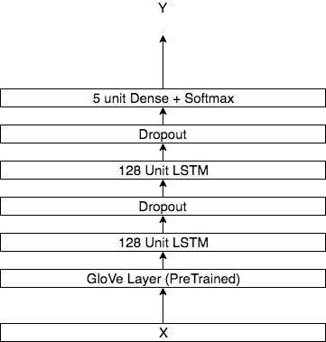

<html>
<head><meta content="text/html; charset=UTF-8" http-equiv="content-type"></head>
<h1 class="c11" id="h.740y7ryjroz9">Sentiment Analysis</h1><h2 class="c12" id="h.566d222m5pfp">Use Case</h2>
The project aims to classify the sentiment of input text into 5 categories: very bad(1), bad(2), neutral(3), good(4), and very good(5)

Input (X): Text

Output (Y): Sentiment Category (1-5)
<h2 class="c12" id="h.wjwvcphm20tn">Dataset </h2>
<a class="c9" href="https://www.google.com/url?q=https://www.yelp.com/dataset&amp;sa=D&amp;ust=1552261754867000">Yelp Dataset</a>&nbsp;which is&nbsp;5,996,996 Yelp reviews, labeled by sentiment (1-5) in JSON format. 
<h2 class="c12" id="h.s66jzo5amq9b">Preprocessing&nbsp;</h2>
Preprocess the dataset in the following order: 
<ul class="c3 lst-kix_b2lnqq41qp75-0 start"><li class="c2">Lowercase all words</li><li class="c2">I&rsquo;m > I am </li><li class="c2">McDonald&#39;s &gt; McDonald</li><li class="c2">Only keep words with known GloVe embeddings. </li></ul>

Since we already have pre-trained GloVe vectors, I did not stem the words; let&rsquo;s use all the information we have. 
<h2 class="c12" id="h.y155vda2kv9c">Data ETL</h2>
JSON to processed and indexed HDF5 format to be used by ML models. Data stored in AWS S3. 

Fig 1. Sentiment Analysis Data Pipeline

All ETL jobs are done in Python. 
<h2 class="c12" id="h.gc4ez7fwl6yc">ML Models</h2>
Evaluated the following models for this project: 
<h3 class="c7" id="h.erjj4zp3mm4e">Global Vectors for Word Representations (GloVe)</h3>
The model is based on Stanford&rsquo;s <a class="c9" href="https://www.google.com/url?q=https://nlp.stanford.edu/projects/glove/&amp;sa=D&amp;ust=1552261754869000">GloVe project</a>&nbsp;[1]. I added a dense layer on top of pre-trained GloVe layer to classify the text. &nbsp;
<h2 class="c13" id="h.lbfz9t3zg2ms"></h2>
Fig 2. GloVe average model architecture

Implemented in TensorFlow. 
<h3 class="c7" id="h.vov4jwvi8oqd">GloVe + Long Short-term Memory (LSTM) </h3>
The model expands on the concept of the previous model with two LSTM layers and dropout in between. &nbsp;

Fig 3. GloVe + LSTM model architecture

Implemented in TensorFlow. 

<h3 class="c7" id="h.oiz8wxxkg38b">GloVe + Bidirectional Long Short-term Memory (BiLSTM) </h3>
The model expands on the concept of the previous model with four LSTM layers and dropout in between. 

Fig 4. GloVe + BiLSTM model architecture

Implemented in TensorFlow. 

<h3 class="c7" id="h.dudj03teqmfe">Deep Pyramid Convolutional Neural Networks (DPCNN)</h3>
Based on Johnson, Rie &amp; Zhang, Tong&rsquo;s DPCNN model[2] for text classification. 

Fig 5. DPCNN Architecture

Implemented in Tensorflow

<h3 class="c7" id="h.ookqs83cx0o5">Universal Language Model Fine-tuning for Text Classification (ULMFiT)</h3>
Based on Jeremy Howard and Sebastian Ruder&rsquo;s ULMFit model[3]. This model is state-of-the-art at the time of this writing. 

Fig 6. ULMFiT model architecture

Implemented in TensorFlow. 
<h2 class="c12" id="h.sqp27v926diz">Training</h2>
The dataset was sliced into 98% training, 1% dev, and 1% testing. The model was trained on one P3.16xlarge with Deep Learning AMI. The model is saved after each epoch. 
<h2 class="c12" id="h.uf474jxf9qel">Inference</h2>
The inference is done with a saved model in a Fargate container. 
<h2 class="c12" id="h.idosp1cl2s5l">Deployment </h2>
Due to Lambda&rsquo;s limitation on size, I had to deploy the last model in a docker container on AWS Fargate.

<h2 class="c12" id="h.4hw9jx6dz801">Reference</h2><ol class="c3 lst-kix_6uaigt98ephh-0 start" start="1"><li class="c2">Jeffrey Pennington, Richard Socher, and Christopher D. Manning. 2014. <a class="c9" href="https://www.google.com/url?q=https://nlp.stanford.edu/pubs/glove.pdf&amp;sa=D&amp;ust=1552261754874000">GloVe: Global Vectors for Word Representation</a>.</li><li class="c2">Johnson, Rie &amp; Zhang, Tong. 2017. <a class="c9" href="https://www.google.com/url?q=https://ai.tencent.com/ailab/media/publications/ACL3-Brady.pdf&amp;sa=D&amp;ust=1552261754874000">Deep Pyramid Convolutional Neural Networks for Text Categorization</a>.</li><li class="c2">Jeremy Howard, Sebastian Ruder. 2018. <a class="c9" href="https://www.google.com/url?q=https://arxiv.org/abs/1801.06146&amp;sa=D&amp;ust=1552261754875000">Universal Language Model Fine-tuning for Text Classification</a></li></ol>

&nbsp; &nbsp; &nbsp; &nbsp; &nbsp; &nbsp; &nbsp; &nbsp; &nbsp; &nbsp; &nbsp; &nbsp; &nbsp; &nbsp; &nbsp; &nbsp; &nbsp; &nbsp; &nbsp; &nbsp; &nbsp; &nbsp; &nbsp; &nbsp; &nbsp; &nbsp; &nbsp; &nbsp; &nbsp; &nbsp; &nbsp; &nbsp; &nbsp; &nbsp; &nbsp; &nbsp; &nbsp; &nbsp; &nbsp; &nbsp; &nbsp; &nbsp; &nbsp; &nbsp; &nbsp; &nbsp; &nbsp; &nbsp; &nbsp; &nbsp; &nbsp; &nbsp; &nbsp; &nbsp; &nbsp; &nbsp; &nbsp; &nbsp; &nbsp; &nbsp; &nbsp; &nbsp; &nbsp; &nbsp; &nbsp; &nbsp;

</html>
